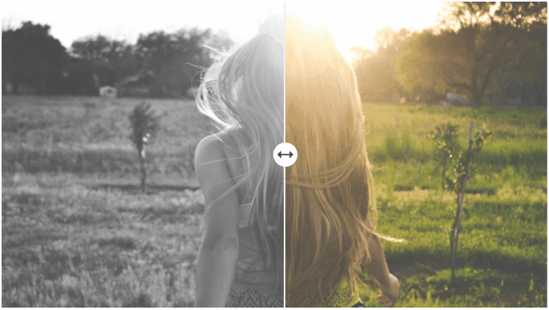

# React Simple Rating

> A simple yet powerful react component for adding a nice before after image slider to your project.

[](https://www.npmjs.com/package/react-simple-before-after)


<p align="center">
  
</p>

## Install

#### npm

```sh
npm i react-simple-before-after
```

#### Yarn

```sh
yarn add react-simple-before-after
```

<br />

## Usage

```jsx
import { BeforeAfter } from 'react-simple-before-after'

export default function MyComponent() {
  return (
    <div className='App'>
      <BeforeAfter
        beforeImage='https://picsum.photos/id/646/1920/1080?grayscale'
        afterImage='https://picsum.photos/id/646/1920/1080'
        /* Other Props */
      />
    </div>
  )
}
```

### Available Props

| Prop              | Type                | Options  | Description                                                                                                          |        Default        |
| ----------------- | ------------------- | -------- | -------------------------------------------------------------------------------------------------------------------- | :-------------------: |
| `beforeImage`     | string              | Required | Before image src                                                                                                     |          `-`          |
| `afterImage`      | string              | Required | After image src                                                                                                      |          `-`          |
| `pointerMove`     | boolean             | Optional | Enables [onPointerMove](https://developer.mozilla.org/en-US/docs/Web/API/Pointer_events) instead of input `onChange` |        `false`        |
| `onChange`        | function            | Optional | onChange callback using input type `range` method (default)                                                          |          `-`          |
| `onPointerMove`   | function            | Optional | onPointerMove callback available when `pointerMove` is enabled                                                       |          `-`          |
| `onPointerEnter`  | function            | Optional | onPointerEnter callback                                                                                              |          `-`          |
| `onPointerLeave`  | function            | Optional | onPointerLeave callback                                                                                              |          `-`          |
| `className`       | string              | Optional | Main `div` className                                                                                                 | `before-after-slider` |
| `beforeClassName` | string              | Optional | Before `div` className                                                                                               |       `before`        |
| `afterClassName`  | string              | Optional | After `div` className                                                                                                |        `after`        |
| `buttonClassName` | string              | Optional | Button `div` className (not availabe if `pointerMove` is enabled)                                                    |    `resize-button`    |
| `style`           | React.CSSProperties | Optional | Main `div` inline style                                                                                              |          `-`          |
| `beforeStyle`     | React.CSSProperties | Optional | Before `div` inline style                                                                                            |          `-`          |
| `afterStyle`      | React.CSSProperties | Optional | After `div` inline style                                                                                             |          `-`          |
| `buttonStyle`     | React.CSSProperties | Optional | Button `div` inline style (not availabe when `pointerMove` is enabled)                                               |          `-`          |

---

<br />

## Demo

See demo [in action](https://react-simple-before-after.vercel.app/).

<br />

[](https://codesandbox.io/s/react-before-after-slider-uk1ys?fontsize=14&hidenavigation=1&theme=dark)

### License

MIT © [awran5](https://github.com/awran5/)
